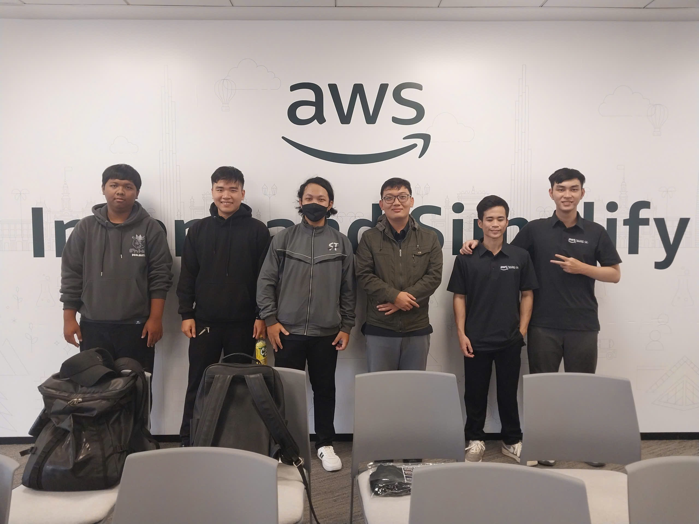

{}
⚠️ **Note:** The following information is for reference purposes only. Please **do not copy verbatim** for your own report, including this warning.
{}

### Week 5 Objectives:

- Deploying Scalable
- Highly Available AWS Architecture

### Tasks to be carried out this week:

| Day | Task                                                                                                                                                                                                            | Start Date | Completion Date | Status |
| --- | --------------------------------------------------------------------------------------------------------------------------------------------------------------------------------------------------------------- | ---------- | --------------- | ------ |
| 2   | - Learn Amazon RDS fundamentals   &emsp; + DB engines (MySQL, PostgreSQL, etc.)   &emsp; + Storage types (gp3, io1, etc.)   &emsp; + Backup & recovery concepts   &emsp; + Multi-AZ & Read Replica  | 18/05/2026 | 18/05/2026      | Done   |
| 3   | - Learn RDS security & architecture   &emsp; + VPC isolation   &emsp; + Encryption (KMS, SSL/TLS)   &emsp; + IAM permissions   &emsp; + Scaling limitations                                         | 19/05/2026 | 19/05/2026      | Done   |
| 4   | - Practice RDS deployment   &emsp; + Create DB Subnet Group   &emsp; + Launch MySQL RDS instance   &emsp; + Configure Security Groups   &emsp; + Connect EC2 → RDS                                  | 20/05/2026 | 20/05/2026      | Done   |
| 5   | - Learn EC2 Auto Scaling & Load Balancing   &emsp; + Auto Scaling Groups   &emsp; + Launch Templates   &emsp; + Elastic Load Balancer (ALB)   &emsp; + Target Groups   &emsp; + Scaling policies | 21/05/2026 | 21/05/2026      | Done   |
| 6   | - Practice Auto Scaling system   &emsp; + Create Launch Template   &emsp; + Create Auto Scaling Group   &emsp; + Configure ALB + Target Group   &emsp; + Test scaling behavior                      | 22/05/2026 | 22/05/2026      | Done   |
| 7   | - Attend the event at AWS                                                                                                                                                                                       | 23/05/2026 | 23/05/2026      | Done   |

### Week 5 Achievements:

### Step 1: Amazon RDS Setup

- Selected MySQL database engine
- Created DB Subnet Group inside VPC
- Configured Security Group for port 3306
- Launched RDS instance in private subnet
- Connected EC2 to RDS using MySQL client

---

### Step 2: RDS Configuration & Security

- Configured encryption (KMS, SSL/TLS)
- Used VPC for network isolation
- Applied IAM-based access control
- Understood backup (automated + snapshots)
- Learned Multi-AZ and Read Replica concepts

---

### Step 3: EC2 Auto Scaling Setup

- Created Launch Template with:
  - AMI
  - Instance type (t2.micro)
  - Key pair
  - Security group

- Created Auto Scaling Group:
  - Defined min / max / desired capacity
  - Distributed across Availability Zones

---

### Step 4: Elastic Load Balancing (ALB)

- Created Application Load Balancer
- Configured Target Group (EC2 instances)
- Set health checks for instance monitoring
- Attached ALB to Auto Scaling Group

---

### Step 5: Scaling Policies

- Configured Dynamic Scaling:
  - CPU-based scaling policy
- Learned:
  - Scale-out (add instances under load)
  - Scale-in (remove instances when idle)

---

## Week 5 Achievements

- Understood Amazon RDS architecture, storage, and security model
- Successfully deployed and connected RDS with EC2
- Learned database backup, replication, and scaling concepts
- Understood EC2 Auto Scaling and Launch Templates
- Successfully created Auto Scaling Group
- Configured Elastic Load Balancer with Target Groups
- Tested automatic scaling behavior under load
- Improved understanding of high availability cloud architecture
- Gained practical experience with production-like AWS infrastructure
  
  
