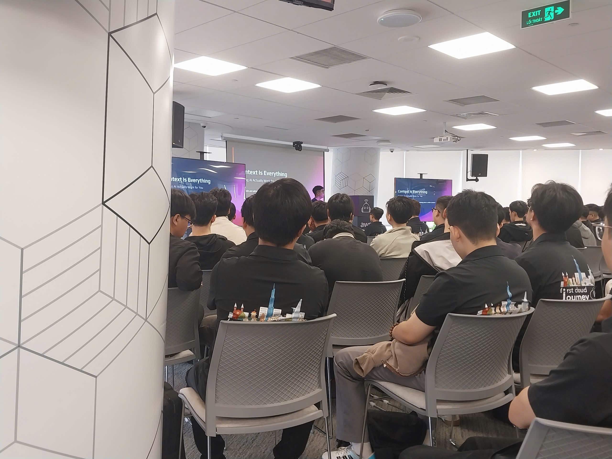

{}
⚠️ **Lưu ý:** Các thông tin dưới đây chỉ nhằm mục đích tham khảo, vui lòng **không sao chép nguyên văn** cho bài báo cáo của bạn kể cả warning này.
{}

### Mục tiêu tuần 5:

- Triển khai kiến ​​trúc AWS có khả năng mở rộng
- Kiến trúc AWS có tính khả dụng cao

### Các công việc cần triển khai trong tuần này:

| Thứ | Công việc                                                                                                                                                                                                    | Ngày bắt đầu | Ngày hoàn thành | Trạng thái |
| --- | ------------------------------------------------------------------------------------------------------------------------------------------------------------------------------------------------------------ | ------------ | --------------- | ---------- |
| 2   | - Tìm hiểu Amazon RDS   &emsp; + Các engine (MySQL, PostgreSQL, …)   &emsp; + Loại storage (gp3, io1, …)   &emsp; + Backup & khôi phục dữ liệu   &emsp; + Multi-AZ & Read Replica                | 18/05/2026   | 18/05/2026      | Hoàn thành |
| 3   | - Tìm hiểu bảo mật và kiến trúc RDS   &emsp; + VPC isolation   &emsp; + Mã hóa (KMS, SSL/TLS)   &emsp; + IAM permissions   &emsp; + Giới hạn scaling                                             | 19/05/2026   | 19/05/2026      | Hoàn thành |
| 4   | - Thực hành triển khai RDS   &emsp; + Tạo DB Subnet Group   &emsp; + Tạo RDS MySQL   &emsp; + Cấu hình Security Group   &emsp; + Kết nối EC2 → RDS                                               | 20/05/2026   | 20/05/2026      | Hoàn thành |
| 5   | - Tìm hiểu Auto Scaling & Load Balancer   &emsp; + Auto Scaling Group   &emsp; + Launch Template   &emsp; + Elastic Load Balancer (ALB)   &emsp; + Target Group   &emsp; + Chính sách scaling | 21/05/2026   | 21/05/2026      | Hoàn thành |
| 6   | - Thực hành hệ thống Auto Scaling   &emsp; + Tạo Launch Template   &emsp; + Tạo Auto Scaling Group   &emsp; + Cấu hình ALB + Target Group   &emsp; + Kiểm tra cơ chế tự scale                    | 22/05/2026   | 22/05/2026      | Hoàn thành |
| 7   | - Tham gia event tại AWS                                                                                                                                                                                     | 23/05/2026   | 23/05/2026      | Hoàn thành |

### Kết quả đạt được tuần 5:

### Bước 1: Cài đặt Amazon RDS

- Chọn engine MySQL
- Tạo DB Subnet Group trong VPC
- Cấu hình Security Group (port 3306)
- Khởi tạo RDS trong private subnet
- Kết nối EC2 tới RDS bằng MySQL client

---

### Bước 2: Cấu hình bảo mật RDS

- Sử dụng VPC để cô lập mạng
- Bật mã hóa dữ liệu (KMS, SSL/TLS)
- Áp dụng IAM permissions
- Tìm hiểu cơ chế backup và snapshot
- Hiểu Multi-AZ và Read Replica

---

### Bước 3: Cài đặt EC2 Auto Scaling

- Tạo Launch Template gồm:
  - AMI
  - Loại instance (t2.micro)
  - Key pair
  - Security Group

- Tạo Auto Scaling Group:
  - Thiết lập min / max / desired capacity
  - Phân bố theo Availability Zones

---

### Bước 4: Cấu hình Elastic Load Balancing

- Tạo Application Load Balancer (ALB)
- Tạo Target Group (EC2 instances)
- Cấu hình health check
- Liên kết ALB với Auto Scaling Group

---

### Bước 5: Cấu hình Scaling Policy

- Thiết lập Dynamic Scaling theo CPU
- Hiểu cơ chế:
  - Scale out (tăng instance khi tải cao)
  - Scale in (giảm instance khi tải thấp)

---

## Kết quả đạt được tuần 5

- Hiểu kiến trúc và cách hoạt động của Amazon RDS
- Triển khai và kết nối thành công RDS với EC2
- Hiểu cơ chế backup, replication và scaling của database
- Hiểu và triển khai EC2 Auto Scaling
- Tạo thành công Load Balancer và Target Group
- Kiểm tra được cơ chế tự động scale hệ thống
- Hiểu mô hình hệ thống cloud có tính sẵn sàng cao (High Availability)
- Nâng cao kỹ năng triển khai hạ tầng AWS thực tế
  
  
